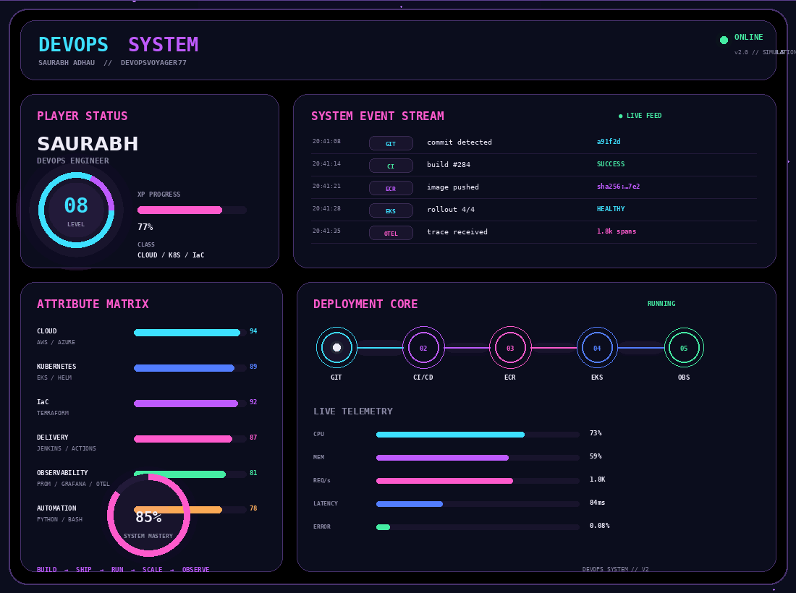

<div align="center">

# ⚡ SAURABH ADHAU

### `DEVOPS ENGINEER` · `CLOUD` · `KUBERNETES` · `IaC` · `OBSERVABILITY`


</div>

<p align="center">

</p>

---

## ⚡ `SYSTEM PROFILE`

```text
PLAYER        SAURABH ADHAU
CLASS         DEVOPS ENGINEER
SPECIALTY     CLOUD • KUBERNETES • IaC • CI/CD • OBSERVABILITY
MISSION       ENGINEER THE PLATFORM BEHIND THE PRODUCT
MODE          AUTOMATE → DEPLOY → OBSERVE → IMPROVE
```

> I build and automate cloud-native platforms with a strong focus on Kubernetes, infrastructure as code, CI/CD and production observability.

### `TECH ARSENAL`

| SYSTEM | TECHNOLOGIES |
|---|---|
| ☁ CLOUD | AWS · Azure · EKS · VPC · IAM · RDS |
| 🏗 IaC | Terraform · Terragrunt |
| ☸ PLATFORM | Kubernetes · Helm · Docker · ECR |
| 🚀 DELIVERY | Jenkins · GitHub Actions · CI/CD |
| 🔭 OBSERVABILITY | Prometheus · Grafana · Loki · OpenTelemetry · Tempo |
| ⚙ AUTOMATION | Python · Bash · Linux |

---

## `ACTIVE MISSIONS`

### ☸ `EKS PLATFORM`
Production-style Kubernetes platform with cloud networking, infrastructure automation, containerized workloads and deployment workflows.

### 🚀 `AUTOMATED DELIVERY`
Source → build → image → registry → Kubernetes deployment, with repeatable CI/CD automation.

### 🔭 `OBSERVABILITY SYSTEM`
Metrics + logs + traces using Prometheus, Grafana, Loki, OpenTelemetry and Tempo across cloud-native workloads.

---

## `CURRENT QUEST`

```text
[ IN PROGRESS ]  GitOps
[ IN PROGRESS ]  Advanced Kubernetes
[ IN PROGRESS ]  Platform Engineering
[  NEXT        ]  DevSecOps
[  NEXT        ]  SRE / Reliability Engineering
```

---

<div align="center">

### `BUILD → SHIP → RUN → SCALE → OBSERVE`

<sub>Engineering the platform behind the product.</sub>

<br><br>


</div>
