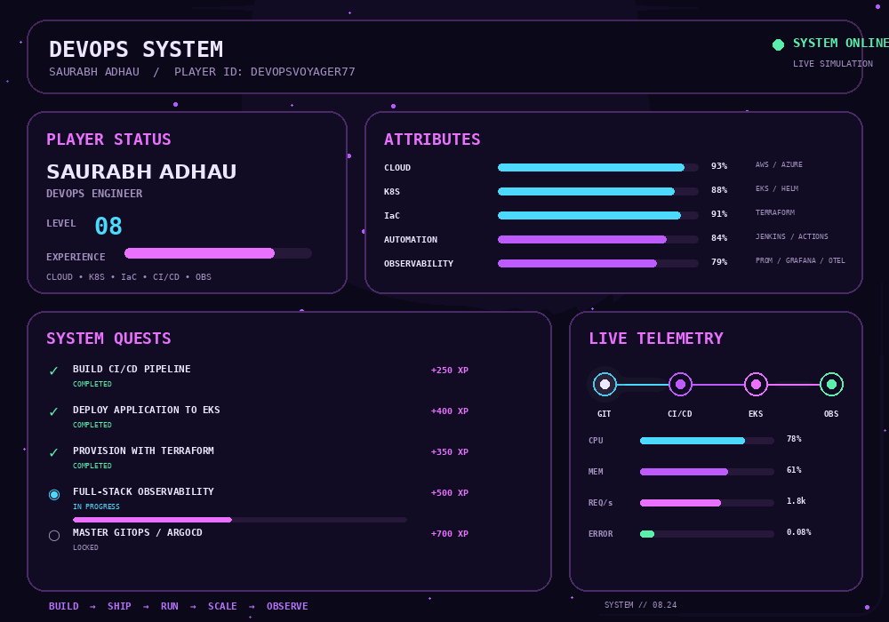

# SAURABH ADHAU

### `DevOps Engineer` · `Cloud` · `Kubernetes` · `Infrastructure as Code` · `Observability`

## `SYSTEM PROFILE`

> **I engineer the platform behind the application.**

| Attribute | Stack |
|---|---|
| ☁ Cloud | AWS · Azure · EKS · VPC · IAM |
| 🏗 Infrastructure | Terraform · Terragrunt |
| ☸ Platform | Kubernetes · Helm · EKS |
| 🚀 Delivery | Jenkins · GitHub Actions · Docker · ECR |
| 🔭 Observability | Prometheus · Grafana · Loki · OpenTelemetry · Tempo |
| ⚙ Automation | Python · Bash · Linux |

## `ACTIVE MISSIONS`

- **Production-style EKS platform** — infrastructure, networking, workloads and deployment automation
- **Automated delivery** — CI/CD from source control through container build and Kubernetes deployment
- **Full-stack observability** — metrics, logs and traces across cloud-native workloads

## `CURRENT QUEST`

`GitOps` · `Argo CD` · `Platform Engineering` · `DevSecOps` · `SRE` · `Advanced Kubernetes`

---

### `BUILD → AUTOMATE → DEPLOY → OBSERVE`

Engineering the platform behind the product.

